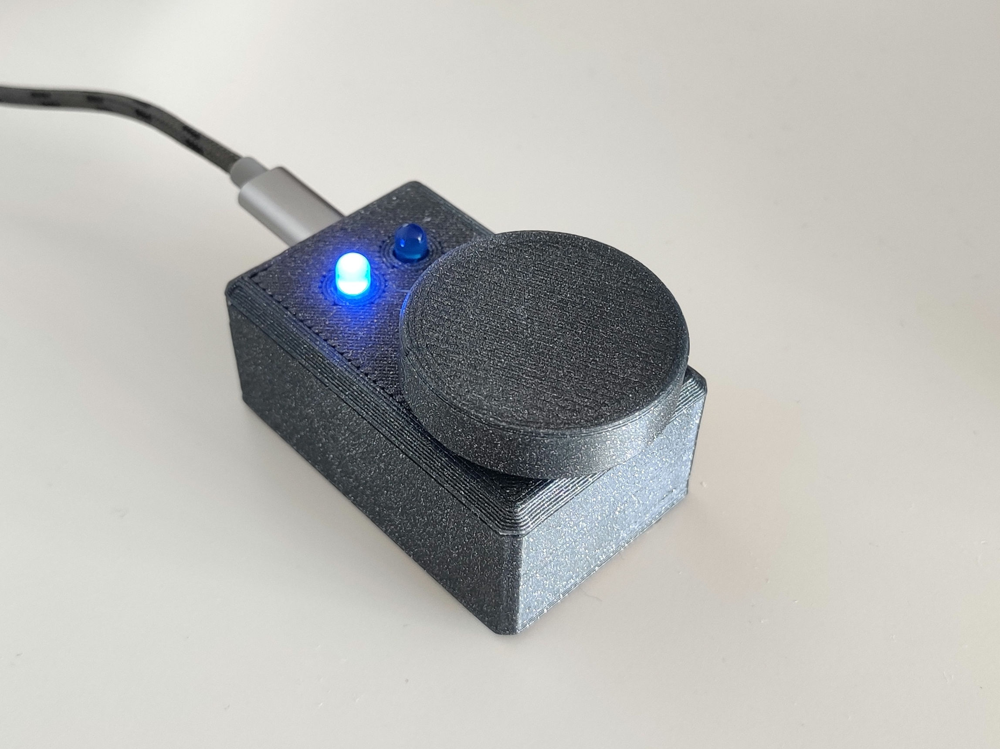

# Desk controller			

##### Desk controller is a simple device that communicates with a PC via serial port and controls sound volume and screen brightness.

___

### Hardware
Parts used:
- Wemos d1 mini
- 2x 330 Ohm resistor
- 2x LED
- EC-11 rotary encoder

___

### Software

##### Embedded
Program for ESP8266 is written in Arduino framework using PlatformIO. It uses [AiEsp32RotaryEncoder](https://github.com/igorantolic/ai-esp32-rotary-encoder "AiEsp32RotaryEncoder") library for handling encoder with interrupts.

##### PC script
The script that comunicate with microcontroller is written in Python 3. It uses multiple libraries:
- [PySerial](https://github.com/pyserial/pyserial "PySerial") for UART communication,
- [PyCaw](https://github.com/AndreMiras/pycaw "PyCaw") for volume manipulation
- [monitorcontrol](https://github.com/newAM/monitorcontrol "monitorcontrol") for brightness chaning via DDC/CI interface 
- [tkinter](https://docs.python.org/3/library/tkinter.html) for displaying dialog box

___

### CAD
The case was designed in FreeCad. Models used:
- https://www.thingiverse.com/thing:1933779 by DonJuanito, CC License
- https://www.thingiverse.com/thing:2970774/ by FrankLumien, CC License

